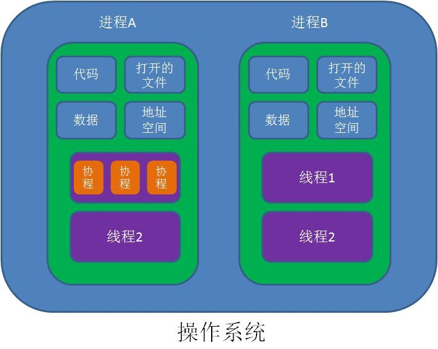

[协程官方指南](http://www.kotlincn.net/docs/reference/coroutines/coroutines-guide.html)

[ 漫画：什么是协程？ ](https://www.sohu.com/a/236536167_684445)

[]()


# demo3

## 博客[https://blog.csdn.net/NJP_NJP/article/details/103524778](https://blog.csdn.net/NJP_NJP/article/details/103524778)中的Demo项目

# demo4

**[Coroutines+Retrofit+Okhttp使用](https://www.jianshu.com/p/b58555b47991)**

# 单词


defer
英 [dɪˈfɜː(r)]
美 [dɪˈfɜːr]
v. 	推迟; 延缓; 展期

deferred
英 [dɪˈfɜːd]
美 [dɪˈfɜːrd]
v. 	推迟; 延缓; 展期;
defer的过去分词和过去式;


# 进程、线程、协程



> 进程就是应用程序的启动实例。比如我们运行一个游戏，打开一个软件，就是开启了一个进程。
进程拥有代码和打开的文件资源、数据资源、独立的内存空间。

> 线程从属于进程，是程序的实际执行者。一个进程至少包含一个主线程，也可以有更多的子线程。
线程拥有自己的栈空间。

> 对操作系统来说，线程是最小的执行单元，进程是最小的资源管理单元。
无论进程还是线程，都是由操作系统所管理的。

> 协程，英文Coroutines，是一种比线程更加轻量级的存在。正如一个进程可以拥有多个线程一样，一个线程也可以拥有多个协程。
协程虽然是微线程，但是并不会和某一个特定的线程绑定，它可以在A线程中执行，并经过某一个时刻的挂起(suspend)，等下次调度到恢复执行的时候，很可能会在B线程中执行。


#

suspend ：

Deferred：

Deferred.await()：

withContext：

# GlobalScope 与 CoroutineScope

```
public object GlobalScope : CoroutineScope {
    /**
     * Returns [EmptyCoroutineContext].
     */
    override val coroutineContext: CoroutineContext
        get() = EmptyCoroutineContext
}
```
GlobalScope 为 CoroutineScope 子类

# JakeWharton/retrofit2-kotlin-coroutines-adapter

[JakeWharton/retrofit2-kotlin-coroutines-adapter ](https://github.com/JakeWharton/retrofit2-kotlin-coroutines-adapter)

```
implementation 'com.jakewharton.retrofit:retrofit2-kotlin-coroutines-adapter:0.9.2'
```

Add CoroutineCallAdapterFactory as a Call adapter when building your Retrofit instance:
```

val retrofit = Retrofit.Builder()
    .baseUrl("https://example.com/")
    .addCallAdapterFactory(CoroutineCallAdapterFactory())
    .build()
```

Your service methods can now use Deferred as their return type.
```

interface MyService {
  @GET("/user")
  fun getUser(): Deferred<User>

  // or

  @GET("/user")
  fun getUser(): Deferred<Response<User>>
}
```
Retrofit 2.6.0 or newer and its built-in suspend support ：
```
@GET("users/{id}")
suspend fun user(@Path("id") id: Long): User
```

# rxbus 与 协程

https://github.com/fengzhizi715/EventBus